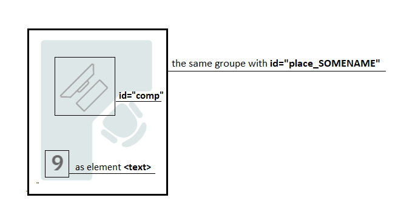
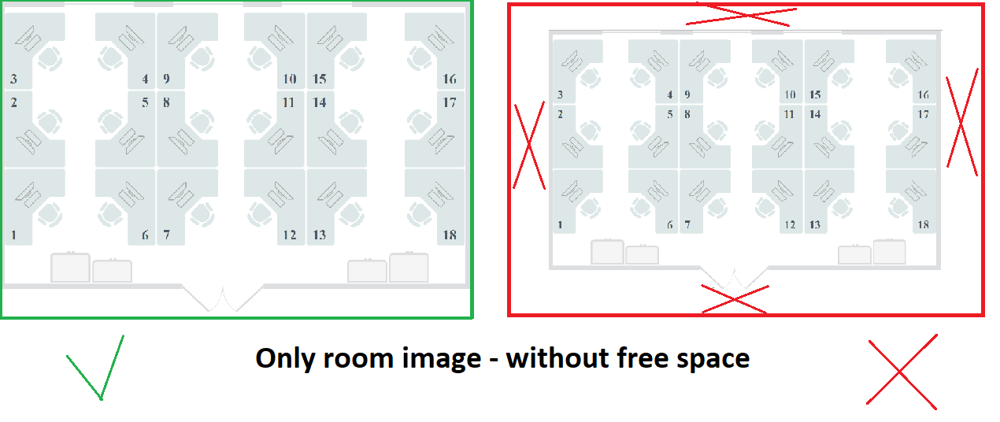

# Optimization SVG files for the WorkSpacePortal

## Important!

### Workplace must be:

- all elements of the workplace must be in **`the same group`**
- the group must have an id with the word "place\_" in the name : **`id="place_SOMENAME"`**
- element computer must have **`id="comp"`**
- the place number must be represented by the tag `<text>`
- room schema must not have free space around

 

## Folder file structure must be as:

    .
    ├── OfficeName_CityName   # folder with office rooms and floors svg
    │   ├── Rooms             # folder with rooms svg
    │   │   ├── roomName.svg
    │   └── Floors            # folder with office rooms and floors svg
    │       ├── floorName.svg
    └──

    for example:

    ├── K3_Gomel
    │   ├── Rooms
    │   │   ├── 201.svg
    │   │   ├── 301.svg
    │   └── Floors
    │       ├── 2.svg
    │       ├── 3.svg
    └──
    if we don't have floors schemas don't create Floors folder

# How to use

# Create office schemas

## Step 1

### run the command **`yarn set`** in the terminal - this command create nessary **`src`** folder with folders in for work app

## Step 2

### put you folders with offices schemas in **`src/SourceFolder`**

## Step 3

### run the command **`yarn createschemas`** in the terminal - this command create:

  - json file with svg schema of rooms as stirng for data base in folder **`server/WSP.WebAPI/Json/Rooms/JSON_FILE`**
  - json file with svg schema of floors as stirng for data base in folder **`server/WSP.WebAPI/Json/Floors/JSON_FILE`**
  - folder with all previews for office rooms in folder **`server/WSP.WebAPI/Images/RoomPreviews/FOLDER_WITH_PREVIEW`**

### run the command **`yarn createschemas local`** in the terminal - this command create ONLY:

  - folder officeName with all rooms and floors schemas and previews in folder **`Resultfolder`** in this app

## Step 4

### run **`yarn deletesrc`** - this command delete folder **`src`** with folders and files in

# Additionaly

## Clear fodlers RoomPreviews, Rooms, Floors on Server

run the command **`yarn clearserver`** - this command :
  - delete files in folder **`server/WSP.WebAPI/Json/Rooms`**
  - delete files in folder **`server/WSP.WebAPI/Json/Floors/`**
  - delete files in folder **`server/WSP.WebAPI/Images/RoomPreviews`**

## Only optimizing SVG

### put svg file in SourseFolder

### run the command **`yarn optimize`** in the terminal - this command create new optimized svg files in the folder **`ResultFolder`**

## Advanced Level

if you change address in **`app/constants/base-pathes in const DESIGNER_FOLDER_PATH = you path`** to address you folders of designer schemas,
 you can start creator without step 1,2

### run the command **`yarn createschemas desk`** in the terminal - this command create:

  - json file with svg schema of rooms as stirng for data base in folder **`server/WSP.WebAPI/Json/Rooms/JSON_FILE`**
  - json file with svg schema of floors as stirng for data base in folder **`server/WSP.WebAPI/Json/Floors/JSON_FILE`**
  - folder with all previews for office rooms in folder **`server/WSP.WebAPI/Images/RoomPreviews/FOLDER_WITH_PREVIEW`**

### run the command **`yarn createschemas desk local`** in the terminal - this command create:

- folder officeName with all rooms and floors schemas and previews in folder **`Resultfolder`** in this app
